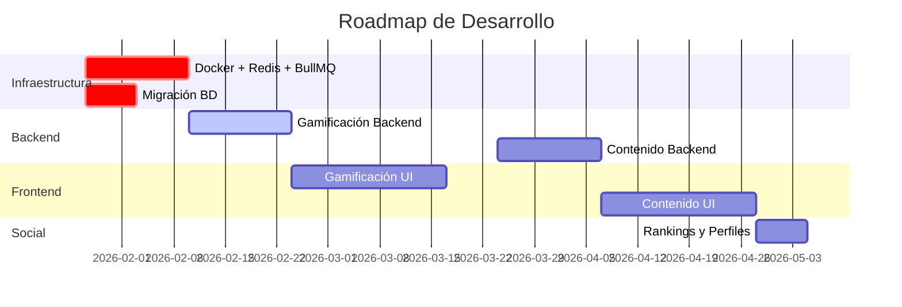

# 🗺️ ROADMAP - Jean Monnet Serious Game

> **Última actualización**: 21 de enero de 2026  
> **Equipo**: 1 Backend Developer + 1 Full Stack Developer  
> **Duración estimada**: 13 semanas (3 meses)

---

## 📅 Timeline General



---

## 🎯 Sprint Overview

| Sprint | Semanas | Responsable | Objetivos Clave |
|--------|---------|-------------|-----------------|
| **1-2** | 1-2 | Backend Dev | Dockerización + Redis + BullMQ + Migración BD |
| **3-4** | 3-4 | Backend Dev | Backend de gamificación completo |
| **5-7** | 5-7 | Full Stack | Frontend de gamificación + UX mejorada |
| **8-9** | 8-9 | Backend Dev | Sistema de lecciones y desbloqueos |
| **10-12** | 10-12 | Full Stack | Frontend de contenido enriquecido |
| **13** | 13 | Full Stack | Perfiles públicos y polish final |

---

## 📦 SPRINT 1-2: Infraestructura (Semanas 1-2)

**Responsable:** Backend Developer  
**Objetivo:** Preparar base tecnológica con Docker, Redis y BullMQ

### ✅ REWORK-1: Dockerización del Proyecto

**Estimación:** 2-3 días  
**Prioridad:** 🔴 CRÍTICA

**Entregables:**
- [ ] `docker-compose.yml` con 5 servicios:
  - PostgreSQL (BD principal)
  - Redis (caché y jobs)
  - Next.js App
  - BullMQ Worker
  - Bull Board (dashboard de jobs)
- [ ] `Dockerfile` para Next.js con multi-stage build
- [ ] `Dockerfile.worker` para workers
- [ ] `.dockerignore` optimizado
- [ ] `README.md` actualizado con comandos Docker
- [ ] Healthchecks para todos los servicios
- [ ] Variables de entorno documentadas

**Testing:**
- [ ] `docker-compose up -d` levanta todos los servicios
- [ ] App accesible en `localhost:3000`
- [ ] Bull Board en `localhost:3001`
- [ ] Hot reload funciona en desarrollo

---

### ✅ REWORK-2: Redis para Caché

**Estimación:** 2 días  
**Prioridad:** 🔴 CRÍTICA

**Entregables:**
- [ ] `lib/redis/client.ts` - Cliente de Redis configurado
- [ ] `lib/redis/leaderboard.ts` - Sorted Sets para rankings
  ```typescript
  class LeaderboardService {
    addPoints(userId, points)
    getTop100()
    getUserRank(userId)
    getUsersAround(userId, range)
  }
  ```
- [ ] `lib/redis/quiz-session.ts` - Sesiones de quiz temporales
  ```typescript
  class QuizSessionService {
    saveSession(userId, session)
    getSession(userId)
    deleteSession(userId)
    extendSession(userId)
  }
  ```
- [ ] `lib/redis/rate-limiter.ts` - Rate limiting
  ```typescript
  class RateLimiter {
    checkLimit(key, maxRequests, windowSeconds)
    canSubmitQuiz(userId)
  }
  ```

**Testing:**
- [ ] Redis responde en < 10ms
- [ ] TTL expira correctamente
- [ ] Sorted Sets mantienen orden
- [ ] Rate limiter previene spam

---

### ✅ REWORK-3: BullMQ para Jobs Asíncronos

**Estimación:** 3-4 días  
**Prioridad:** 🔴 CRÍTICA

**Entregables:**
- [ ] Estructura de workers:
  ```
  workers/
  ├── index.ts              # Entry point con workers
  ├── queues/
  │   ├── ranking.queue.ts
  │   ├── streak.queue.ts
  │   ├── badge.queue.ts
  │   └── email.queue.ts
  └── processors/
      ├── ranking.processor.ts
      ├── streak.processor.ts
      ├── badge.processor.ts
      └── email.processor.ts
  ```

- [ ] **Ranking Queue:**
  - Job cada 5 minutos para recalcular rankings
  - Guardar en Redis y `leaderboard_cache`
  
- [ ] **Streak Queue:**
  - Job diario (00:00) para verificar streaks
  - Actualizar/resetear `current_streak`
  - Notificar si racha rota
  
- [ ] **Badge Queue:**
  - Job on-demand al completar quiz
  - Verificar criterios de badges
  - Asignar badges ganados
  
- [ ] **Email Queue:**
  - Job on-demand para emails
  - Notificaciones de level-up, badges, etc.

- [ ] Script `npm run build:worker` en `package.json`
- [ ] Bull Board integrado y accesible

**Testing:**
- [ ] Workers procesan jobs sin errores
- [ ] Jobs se reintentan si fallan
- [ ] Bull Board muestra jobs en tiempo real
- [ ] Cron jobs se ejecutan a horario

---

### ✅ REWORK-4: Migración de Base de Datos

**Estimación:** 2 días  
**Prioridad:** 🟠 ALTA

**Entregables:**
- [ ] **Modificar `drizzle/schema.ts`:**
  - Tabla `users`: Añadir `xp`, `level`, `current_streak`, `longest_streak`, `last_activity_date`, `total_points`, `avatar_url`, `bio`, `is_profile_public`
  - Tabla `units`: Añadir `order`, `unlock_previous_required`, `estimated_duration_minutes`
  - Tabla `quizzes`: Añadir `time_limit_seconds`, `started_at`, `finished_at`, `time_spent_seconds`, `questions_marked_for_review` (jsonb), `xp_earned`, `points_earned`
  - Tabla `achievements`: Añadir `type`, `badge_image_url`, `category`, `rarity`

- [ ] **Crear nuevas tablas:**
  - `user_stats` - Estadísticas agregadas
  - `daily_activity` - Actividad diaria
  - `xp_transactions` - Historial de XP
  - `points_transactions` - Historial de puntos
  - `user_badges` - Badges obtenidos
  - `leaderboard_cache` - Cache de rankings (para histórico)

- [ ] Generar migraciones: `npm run generate`
- [ ] Script `scripts/migrate-historical-data.ts`:
  - Calcular XP retroactivo de quizzes existentes
  - Poblar `daily_activity` desde quizzes
  - Crear `user_stats` iniciales

**Testing:**
- [ ] Migraciones aplican sin errores
- [ ] Datos históricos migrados correctamente
- [ ] Rollback funciona si es necesario

---

## 🚀 SPRINT 3-4: Gamificación Backend (Semanas 3-4)

**Responsable:** Backend Developer  
**Objetivo:** Implementar lógica de gamificación completa

### ✅ 1.1 Sistema de XP y Niveles

**Estimación:** 2 días

**Controllers:**
- [ ] `controllers/xp.ts`:
  ```typescript
  export const addXP = async (userId, amount, source, sourceId?) => {
    // 1. Actualizar users.xp
    // 2. Calcular nuevo nivel
    // 3. Insertar en xp_transactions
    // 4. Si subió de nivel, encolar job para notificar
    // 5. Retornar { newXP, newLevel, leveledUp }
  }
  
  export const calculateLevel = (xp: number): number => {
    // Fórmula: level = floor(sqrt(xp / 100))
  }
  
  export const getXPForNextLevel = (level: number): number => {
    // XP necesario para nivel N+1
  }
  
  export const getUserXPProgress = async (userId) => {
    // Retornar { currentXP, currentLevel, nextLevelXP, progress% }
  }
  ```

**Constantes:**
- [ ] `lib/constants/xp.ts`:
  ```typescript
  export const XP_REWARDS = {
    QUIZ_BASE: 20,
    PERFECT_SCORE: 50,
    LESSON_COMPLETE: 10,
    DAILY_LOGIN: 5,
    STREAK_BONUS: 10, // Por cada 7 días
  }
  
  export const LEVELS = {
    1: 0,
    2: 100,
    3: 400,
    4: 900,
    5: 1600,
    // ... hasta 100
  }
  ```

**Integración:**
- [ ] Modificar `controllers/quizzes.ts`:
  ```typescript
  export const submitQuiz = async (...) => {
    // ... código existente
    
    // Calcular XP
    const xpEarned = calculateQuizXP(score, quiz);
    
    // Añadir XP
    const { newLevel, leveledUp } = await addXP(
      userId, 
      xpEarned, 
      'quiz', 
      quizId
    );
    
    // Guardar xp_earned en quiz
    await db.update(quizzes)
      .set({ xp_earned: xpEarned })
      .where(eq(quizzes.id, quizId));
    
    // Si subió de nivel, notificar
    if (leveledUp) {
      await emailQueue.add('level-up', { userId, newLevel });
    }
  }
  ```

---

### ✅ 1.2 Sistema de Rachas (Streaks)

**Estimación:** 2 días

**Controllers:**
- [ ] `controllers/streaks.ts`:
  ```typescript
  export const updateStreak = async (userId: UUID) => {
    const user = await getUser(userId);
    const today = new Date();
    const lastActivity = user.last_activity_date;
    
    if (isToday(lastActivity)) {
      // Ya actualizó hoy, no hacer nada
      return user.current_streak;
    }
    
    if (isYesterday(lastActivity)) {
      // Continuar racha
      const newStreak = user.current_streak + 1;
      await db.update(users)
        .set({
          current_streak: newStreak,
          longest_streak: Math.max(newStreak, user.longest_streak),
          last_activity_date: today
        })
        .where(eq(users.id, userId));
      
      return newStreak;
    }
    
    // Racha rota, resetear
    await db.update(users)
      .set({
        current_streak: 1,
        last_activity_date: today
      })
      .where(eq(users.id, userId));
    
    return 1;
  }
  
  export const getStreakStats = async (userId: UUID) => {
    // Retornar current_streak, longest_streak, days_until_break
  }
  ```

**Worker:**
- [ ] `workers/processors/streak.processor.ts`:
  ```typescript
  export async function streakProcessor(job: Job) {
    // Job programado diariamente a las 00:00
    
    const users = await db.select().from(users);
    
    for (const user of users) {
      const lastActivity = user.last_activity_date;
      
      if (!isYesterday(lastActivity) && !isToday(lastActivity)) {
        // Racha rota
        if (user.current_streak > 0) {
          await db.update(users)
            .set({ current_streak: 0 })
            .where(eq(users.id, user.id));
          
          // Notificar
          await emailQueue.add('streak-broken', { userId: user.id });
        }
      }
    }
  }
  ```

**Queue:**
- [ ] `workers/queues/streak.queue.ts`:
  ```typescript
  export async function scheduleDailyStreakCheck() {
    await streakQueue.add(
      'check-streaks',
      {},
      {
        repeat: {
          pattern: '0 0 * * *' // Cron: medianoche
        }
      }
    );
  }
  ```

**Integración:**
- [ ] Modificar `controllers/quizzes.ts`:
  ```typescript
  // Al completar quiz
  await updateStreak(userId);
  ```

---

### ✅ 1.3 Sistema de Puntos

**Estimación:** 1 día

**Controllers:**
- [ ] `controllers/points.ts`:
  ```typescript
  export const addPoints = async (userId, amount, source, sourceId?) => {
    // 1. Actualizar users.total_points
    // 2. Insertar en points_transactions
    // 3. Actualizar Redis Sorted Set para ranking
  }
  
  export const calculateQuizPoints = (quiz, user) => {
    let points = quiz.score; // Puntos base = score del quiz
    
    // Bonus por perfect score
    if (quiz.score === 100) {
      points += 50;
    }
    
    // Bonus por racha (10 puntos por cada 7 días)
    points += Math.floor(user.current_streak / 7) * 10;
    
    // Bonus por velocidad (si completó en < 50% del tiempo)
    if (quiz.time_spent_seconds < quiz.time_limit_seconds * 0.5) {
      points += 20;
    }
    
    return points;
  }
  ```

**Integración:**
- [ ] Modificar `controllers/quizzes.ts`:
  ```typescript
  // Al completar quiz
  const pointsEarned = calculateQuizPoints(quiz, user);
  
  await addPoints(userId, pointsEarned, 'quiz', quizId);
  
  await db.update(quizzes)
    .set({ points_earned: pointsEarned })
    .where(eq(quizzes.id, quizId));
  ```

---

### ✅ 1.4 Sistema de Badges

**Estimación:** 2 días

**Controllers:**
- [ ] `controllers/badges.ts`:
  ```typescript
  export const checkAndAssignBadges = async (userId, eventType, data) => {
    // Verificar criterios según eventType
    const badgesToAward = [];
    
    switch (eventType) {
      case 'quiz_completed':
        if (data.score === 100) badgesToAward.push('PERFECT_SCORE');
        if (data.timeSpent < 300) badgesToAward.push('SPEED_DEMON');
        break;
      
      case 'streak_milestone':
        if (data.streak === 7) badgesToAward.push('WEEK_WARRIOR');
        if (data.streak === 30) badgesToAward.push('MONTH_MASTER');
        break;
      
      case 'level_up':
        if (data.level === 10) badgesToAward.push('LEVEL_10');
        break;
    }
    
    // Insertar badges
    for (const badgeType of badgesToAward) {
      await db.insert(user_badges).values({
        user_id: userId,
        badge_type: badgeType,
        badge_name: getBadgeName(badgeType),
        earned_at: new Date()
      }).onConflictDoNothing();
    }
    
    return badgesToAward;
  }
  
  export const getUserBadges = async (userId) => {
    // Retornar badges obtenidos
  }
  
  export const getAllBadges = async () => {
    // Retornar todos los badges posibles
  }
  ```

**Worker:**
- [ ] `workers/processors/badge.processor.ts`:
  ```typescript
  export async function badgeProcessor(job: Job) {
    const { userId, eventType, data } = job.data;
    
    const badges = await checkAndAssignBadges(userId, eventType, data);
    
    if (badges.length > 0) {
      // Notificar al usuario
      await emailQueue.add('badges-earned', { userId, badges });
    }
    
    return { badgesAwarded: badges };
  }
  ```

**Integración:**
- [ ] Modificar `controllers/quizzes.ts`:
  ```typescript
  // Al completar quiz
  await badgeQueue.add('check-badges', {
    userId,
    eventType: 'quiz_completed',
    data: { score, timeSpent }
  });
  ```

---

### ✅ 1.5 Sistema de Rankings

**Estimación:** 2 días

**Controllers:**
- [ ] `controllers/leaderboards.ts`:
  ```typescript
  export const getGlobalLeaderboard = async (period = 'weekly', limit = 100) => {
    const cacheKey = `leaderboard:global:${period}`;
    
    // Intentar desde Redis primero
    const cached = await redis.get(cacheKey);
    if (cached) return JSON.parse(cached);
    
    // Si no existe, calcular (debería estar en caché por worker)
    const ranking = await calculateRanking(null, period);
    await redis.setex(cacheKey, 300, JSON.stringify(ranking));
    
    return ranking;
  }
  
  export const getSubjectLeaderboard = async (subjectId, period, limit) => {
    // Similar a global pero filtrado por materia
  }
  
  export const getUserRank = async (userId, subjectId?) => {
    // Obtener posición del usuario desde Redis Sorted Set
    const key = subjectId 
      ? `leaderboard:subject:${subjectId}` 
      : `leaderboard:global`;
    
    const rank = await redis.zrevrank(key, userId);
    return rank !== null ? rank + 1 : 0;
  }
  ```

**Redis Service:**
- [ ] `lib/redis/leaderboard.ts`:
  ```typescript
  export class LeaderboardService {
    async addPoints(userId: string, points: number) {
      await redis.zincrby('leaderboard:global', points, userId);
    }
    
    async getTop100() {
      return await redis.zrevrange('leaderboard:global', 0, 99, 'WITHSCORES');
    }
    
    async getUserRank(userId: string) {
      const rank = await redis.zrevrank('leaderboard:global', userId);
      return rank !== null ? rank + 1 : 0;
    }
    
    async getUsersAround(userId: string, range = 5) {
      const userRank = await redis.zrevrank('leaderboard:global', userId);
      if (userRank === null) return [];
      
      const start = Math.max(0, userRank - range);
      const end = userRank + range;
      
      return await redis.zrevrange('leaderboard:global', start, end, 'WITHSCORES');
    }
  }
  ```

**Worker:**
- [ ] `workers/processors/ranking.processor.ts`:
  ```typescript
  export async function rankingProcessor(job: Job) {
    const { subjectId, period } = job.data;
    
    // Query complejo para calcular ranking
    const ranking = await db
      .select({
        userId: users.id,
        fullName: users.full_name,
        totalPoints: sql`SUM(${quizzes.score})`,
        // ... más campos
      })
      .from(users)
      .leftJoin(quizzes, eq(users.id, quizzes.user_id))
      // ... filtros por período y materia
      .groupBy(users.id)
      .orderBy(desc(sql`total_points`))
      .limit(100);
    
    // Guardar en Redis
    const cacheKey = `leaderboard:${subjectId || 'global'}:${period}`;
    await redis.setex(cacheKey, 300, JSON.stringify(ranking));
    
    // Guardar en leaderboard_cache para histórico
    for (const [index, entry] of ranking.entries()) {
      await db.insert(leaderboard_cache).values({
        subject_id: subjectId,
        period,
        user_id: entry.userId,
        rank_position: index + 1,
        total_points: entry.totalPoints,
        // ...
        updated_at: new Date()
      }).onConflictDoUpdate({
        target: [leaderboard_cache.subject_id, leaderboard_cache.period, leaderboard_cache.user_id],
        set: {
          rank_position: index + 1,
          total_points: entry.totalPoints,
          updated_at: new Date()
        }
      });
    }
    
    return { success: true, recordsProcessed: ranking.length };
  }
  ```

**Queue:**
- [ ] `workers/queues/ranking.queue.ts`:
  ```typescript
  export async function scheduleRankingUpdates() {
    // Calcular rankings cada 5 minutos
    await rankingQueue.add(
      'calculate-weekly-ranking',
      { period: 'weekly' },
      { repeat: { every: 300000 } }
    );
    
    // Ranking mensual cada hora
    await rankingQueue.add(
      'calculate-monthly-ranking',
      { period: 'monthly' },
      { repeat: { every: 3600000 } }
    );
  }
  ```

---

### ✅ 1.6 Sistema de Estadísticas

**Estimación:** 1 día

**Controllers:**
- [ ] `controllers/stats.ts`:
  ```typescript
  export const getUserStats = async (userId) => {
    return await db.query.user_stats.findFirst({
      where: eq(user_stats.user_id, userId)
    });
  }
  
  export const updateDailyActivity = async (userId, data) => {
    const today = new Date().toISOString().split('T')[0];
    
    await db.insert(daily_activity).values({
      user_id: userId,
      activity_date: today,
      study_minutes: data.studyMinutes,
      quizzes_completed: data.quizzesCompleted,
      xp_earned: data.xpEarned,
      points_earned: data.pointsEarned
    }).onConflictDoUpdate({
      target: [daily_activity.user_id, daily_activity.activity_date],
      set: {
        study_minutes: sql`${daily_activity.study_minutes} + ${data.studyMinutes}`,
        quizzes_completed: sql`${daily_activity.quizzes_completed} + 1`,
        xp_earned: sql`${daily_activity.xp_earned} + ${data.xpEarned}`,
        points_earned: sql`${daily_activity.points_earned} + ${data.pointsEarned}`
      }
    });
  }
  ```

**Worker:**
- [ ] `workers/processors/stats.processor.ts`:
  ```typescript
  // Job cada hora para agregar user_stats
  export async function statsProcessor(job: Job) {
    const users = await db.select().from(users);
    
    for (const user of users) {
      const stats = await calculateUserStats(user.id);
      
      await db.update(user_stats)
        .set({
          total_quizzes_completed: stats.totalQuizzes,
          total_correct_answers: stats.totalCorrect,
          average_quiz_score: stats.avgScore,
          // ...
          last_updated: new Date()
        })
        .where(eq(user_stats.user_id, user.id));
    }
  }
  ```

---

## 🎨 SPRINT 5-7: Gamificación Frontend (Semanas 5-7)

**Responsable:** Full Stack Developer  
**Objetivo:** Crear UI completa de gamificación

### ✅ 2.1 Dashboard de Progreso

**Estimación:** 1 semana

**Componentes:**
- [ ] `components/dashboard/UserProgressCard.tsx`:
  ```tsx
  // Mostrar nivel, XP, barra de progreso
  // Icono de racha con fuego 🔥
  // Animación al subir de nivel
  ```

- [ ] `components/dashboard/StatsGrid.tsx`:
  ```tsx
  // Grid 2x2 con stats clave:
  // - Tiempo total de estudio
  // - Temas completados
  // - Precisión promedio
  // - Quizzes completados
  ```

- [ ] `components/dashboard/WeeklyGoalCard.tsx`:
  ```tsx
  // Meta semanal de estudio
  // Progreso con gráfica de barras (Recharts)
  // Mensaje motivacional
  ```

- [ ] `components/dashboard/ContinueStudying.tsx`:
  ```tsx
  // Última materia/unidad estudiada
  // Botón "Continuar donde lo dejaste"
  // Progreso de la unidad
  ```

- [ ] `components/dashboard/RecentActivity.tsx`:
  ```tsx
  // Timeline de últimos quizzes y logros
  // Iconos y badges
  ```

**Rutas:**
- [ ] `app/(main)/dashboard/page.tsx`:
  ```tsx
  export default function DashboardPage() {
    return (
      <div className="grid gap-4">
        <UserProgressCard />
        <StatsGrid />
        <WeeklyGoalCard />
        <ContinueStudying />
        <RecentActivity />
      </div>
    );
  }
  ```

**Integración:**
- [ ] Modificar `components/user-progress.tsx` (ya existe) para mostrar XP y nivel
- [ ] Añadir endpoint API: `app/api/dashboard/route.ts`

---

### ✅ 2.2 Sistema de Badges Visual

**Estimación:** 1 semana

**Componentes:**
- [ ] `components/badges/BadgeGrid.tsx`:
  ```tsx
  // Grid responsive de badges
  // Obtenidos: color, con efecto brillo
  // Bloqueados: grayscale, blur
  // Hover: tooltip con descripción
  // Rareza: borde de color (common, rare, epic, legendary)
  ```

- [ ] `components/badges/BadgeCard.tsx`:
  ```tsx
  // Imagen del badge (iconos de lucide-react)
  // Nombre y descripción
  // Fecha de obtención (si está obtenido)
  // Progress hacia el badge (si aplica)
  ```

- [ ] `components/badges/BadgeNotification.tsx`:
  ```tsx
  // Toast animado cuando se gana badge
  // Confetti con js-confetti (ya instalado)
  // Botón "Ver badge" que lleva a galería
  ```

**Rutas:**
- [ ] `app/(main)/profile/badges/page.tsx`:
  ```tsx
  export default function BadgesPage() {
    const badges = await getUserBadges(userId);
    const allBadges = await getAllBadges();
    
    return (
      <div>
        <h1>Mis Badges</h1>
        <BadgeGrid 
          userBadges={badges} 
          allBadges={allBadges} 
        />
      </div>
    );
  }
  ```

**Integración:**
- [ ] Modificar `app/(main)/quiz/[id]/Quiz.tsx`:
  ```tsx
  // Al completar quiz, verificar si ganó badges
  onSubmit={async () => {
    const result = await submitQuiz(...);
    
    if (result.badgesEarned.length > 0) {
      // Mostrar BadgeNotification
      // Lanzar confetti
    }
  }}
  ```

---

### ✅ 2.3 Leaderboard/Rankings

**Estimación:** 1 semana

**Componentes:**
- [ ] `components/leaderboard/LeaderboardPodium.tsx`:
  ```tsx
  // Podio 3D para top 3
  // Medallas: 🥇🥈🥉
  // Avatar, nombre, puntos
  // Animaciones con Framer Motion
  ```

- [ ] `components/leaderboard/LeaderboardTable.tsx`:
  ```tsx
  // Tabla posiciones 4-100
  // Columnas: Rank, Avatar, Nombre, Puntos, Promedio, Racha
  // Resaltar fila del usuario actual
  // Sticky header
  ```

- [ ] `components/leaderboard/LeaderboardSidebar.tsx`:
  ```tsx
  // Stats personales:
  // - Tu posición
  // - Puntos totales
  // - Progreso hacia top 10
  // - Usuarios cercanos (±5 posiciones)
  ```

- [ ] `components/leaderboard/PeriodSelector.tsx`:
  ```tsx
  // Tabs: Semanal / Mensual / Histórico
  // Dropdown: Global / Por materia
  ```

**Rutas:**
- [ ] `app/(main)/leaderboard/page.tsx`:
  ```tsx
  export default async function LeaderboardPage({ searchParams }) {
    const period = searchParams.period || 'weekly';
    const subjectId = searchParams.subject;
    
    const leaderboard = subjectId
      ? await getSubjectLeaderboard(subjectId, period)
      : await getGlobalLeaderboard(period);
    
    return (
      <div className="grid grid-cols-3 gap-4">
        <div className="col-span-2">
          <PeriodSelector />
          <LeaderboardPodium top3={leaderboard.slice(0, 3)} />
          <LeaderboardTable data={leaderboard.slice(3)} />
        </div>
        <LeaderboardSidebar />
      </div>
    );
  }
  ```

---

### ✅ 2.4 Exámenes Mejorados

**Estimación:** 1 semana

**Componentes:**
- [ ] `components/quiz/QuizTimer.tsx`:
  ```tsx
  // Countdown circular
  // Warning cuando quedan < 2 min (color rojo)
  // Auto-submit cuando llega a 0
  // Pausar si usuario sale de la página
  ```

- [ ] `components/quiz/QuestionNavigator.tsx`:
  ```tsx
  // Mini grid de preguntas (ej: 3x5 para 15 preguntas)
  // Estados:
  //   - Respondida: verde
  //   - Marcada: amarillo
  //   - Actual: azul/outline
  //   - Sin responder: gris
  // Click para saltar a pregunta
  ```

- [ ] `components/quiz/QuestionCard.tsx` (mejorar existente):
  ```tsx
  // Añadir:
  // - Botón "Marcar para revisar" (🚩)
  // - Badge de dificultad (fácil/difícil)
  // - Número de pregunta (1/15)
  ```

- [ ] `components/quiz/QuizResults.tsx`:
  ```tsx
  // Pantalla de resultados:
  // - Puntuación grande (animada)
  // - XP ganado (con animación)
  // - Puntos ganados
  // - Badges obtenidos (mostrar nuevos)
  // - Gráfica de aciertos/fallos
  // - Tiempo empleado
  // - Botones: "Ver respuestas", "Rehacer", "Siguiente unidad"
  // - Confetti si perfect score (js-confetti)
  ```

**Modificaciones:**
- [ ] `app/(main)/quiz/[id]/Quiz.tsx`:
  ```tsx
  // Añadir estado:
  const [startedAt, setStartedAt] = useState<Date>();
  const [markedQuestions, setMarkedQuestions] = useState<number[]>([]);
  
  // Guardar en Redis cada 30 segundos
  useEffect(() => {
    const interval = setInterval(() => {
      saveQuizSession(userId, {
        quizId,
        startedAt,
        questionsAnswered: answers,
        markedForReview: markedQuestions
      });
    }, 30000);
    
    return () => clearInterval(interval);
  }, [answers, markedQuestions]);
  
  // Al finalizar
  const handleSubmit = async () => {
    if (!confirmFinish()) return;
    
    const finishedAt = new Date();
    const timeSpent = (finishedAt - startedAt) / 1000;
    
    const result = await submitQuiz({
      // ...datos existentes
      started_at: startedAt,
      finished_at: finishedAt,
      time_spent_seconds: timeSpent,
      questions_marked_for_review: markedQuestions
    });
    
    // Mostrar QuizResults
    setShowResults(true);
    
    // Si perfect score, confetti
    if (result.score === 100) {
      confetti.addConfetti();
    }
  };
  ```

---

### ✅ 2.5 Perfil de Usuario Mejorado

**Estimación:** 4 días

**Componentes:**
- [ ] `components/profile/ProfileHeader.tsx`:
  ```tsx
  // Avatar (editable)
  // Nombre completo
  // Nivel y XP (con barra de progreso)
  // Racha actual (🔥 7 días)
  // Bio (editable)
  ```

- [ ] `components/profile/ProfileStats.tsx`:
  ```tsx
  // Gráficas con Recharts:
  // - Progreso semanal (gráfica de líneas)
  // - Calendario de actividad tipo GitHub (heatmap)
  // - Distribución de puntuaciones (gráfica de barras)
  // Stats detalladas en cards
  ```

- [ ] `components/profile/ProfileBadges.tsx`:
  ```tsx
  // Showcase de 6 badges destacados
  // Botón "Ver todos" → /profile/badges
  ```

- [ ] `components/profile/XPTransactionHistory.tsx`:
  ```tsx
  // Timeline de XP ganado
  // Filtros: Por fuente (quiz, lesson, achievement)
  // Scroll infinito
  ```

**Rutas:**
- [ ] Modificar `app/(main)/profile/page.tsx`:
  ```tsx
  export default async function ProfilePage() {
    const user = await getUser(userId);
    const stats = await getUserStats(userId);
    const badges = await getUserBadges(userId);
    const xpHistory = await getXPTransactions(userId, { limit: 10 });
    
    return (
      <div>
        <ProfileHeader user={user} />
        <ProfileStats stats={stats} />
        <ProfileBadges badges={badges} />
        <XPTransactionHistory history={xpHistory} />
      </div>
    );
  }
  ```

---

## 📚 SPRINT 8-9: Contenido Enriquecido Backend (Semanas 8-9)

**Responsable:** Backend Developer  
**Objetivo:** Sistema de lecciones y desbloqueos

### ✅ 3.1 Sistema de Lecciones

**Estimación:** 1 semana

**Controllers:**
- [ ] `controllers/lessons.ts`:
  ```typescript
  export const createLesson = async (lesson: InsertLesson) => {
    // Crear lección
    // Si es primera lección de unidad, está desbloqueada
  }
  
  export const updateLesson = async (id, lesson) => {}
  export const deleteLesson = async (id) => {}
  
  export const getLessons = async (unitId) => {
    // Obtener lecciones ordenadas por `order`
  }
  
  export const getLesson = async (id) => {
    // Con objectives y resources
  }
  
  export const reorderLessons = async (unitId, order[]) => {
    // Actualizar orden masivamente
  }
  ```

- [ ] `controllers/lesson-progress.ts`:
  ```typescript
  export const markLessonComplete = async (userId, lessonId) => {
    const lesson = await getLesson(lessonId);
    
    // Marcar como completada
    await db.update(lesson_progress)
      .set({
        status: 'completed',
        progress_percentage: 100,
        completed_at: new Date()
      })
      .where(and(
        eq(lesson_progress.user_id, userId),
        eq(lesson_progress.lesson_id, lessonId)
      ));
    
    // Añadir XP
    await addXP(userId, lesson.xp_reward, 'lesson', lessonId);
    
    // Desbloquear siguiente lección
    await unlockNextLesson(userId, lessonId);
    
    // Actualizar progreso de unidad
    await updateUnitProgress(userId, lesson.unit_id);
  }
  
  export const updateVideoProgress = async (userId, lessonId, seconds) => {
    // Actualizar video_progress_seconds
    // Calcular progress_percentage
  }
  
  export const getLessonProgress = async (userId, lessonId) => {}
  
  export const getUnitProgress = async (userId, unitId) => {
    // Calcular % de lecciones completadas
    // Calcular % de quizzes completados
    // Progress general de unidad
  }
  ```

**Nuevas tablas:**
- Ya definidas en schema (REWORK-4):
  - `lessons`
  - `lesson_objectives`
  - `lesson_resources`
  - `lesson_progress`
  - `lesson_notes`
  - `unit_progress`

---

### ✅ 3.2 Sistema de Desbloqueo Secuencial

**Estimación:** 3 días

**Controllers:**
- [ ] `controllers/unlocks.ts`:
  ```typescript
  export const checkUnitUnlocked = async (userId, unitId) => {
    const unit = await getUnit(unitId);
    
    if (!unit.unlock_previous_required) {
      return true; // Siempre desbloqueada
    }
    
    // Buscar unidad anterior
    const previousUnit = await db.query.units.findFirst({
      where: and(
        eq(units.subject_id, unit.subject_id),
        eq(units.order, unit.order - 1)
      )
    });
    
    if (!previousUnit) {
      return true; // Primera unidad, siempre desbloqueada
    }
    
    // Verificar si completó unidad anterior
    const progress = await getUnitProgress(userId, previousUnit.id);
    return progress.progress_percentage >= 80; // 80% para desbloquear
  }
  
  export const checkLessonUnlocked = async (userId, lessonId) => {
    const lesson = await getLesson(lessonId);
    
    if (!lesson.unlock_previous_required) {
      return true;
    }
    
    // Primera lección, siempre desbloqueada
    if (lesson.order === 1) {
      return true;
    }
    
    // Verificar si completó lección anterior
    const previousLesson = await db.query.lessons.findFirst({
      where: and(
        eq(lessons.unit_id, lesson.unit_id),
        eq(lessons.order, lesson.order - 1)
      )
    });
    
    const progress = await getLessonProgress(userId, previousLesson.id);
    return progress?.status === 'completed';
  }
  
  export const unlockNextUnit = async (userId, unitId) => {
    const unit = await getUnit(unitId);
    const nextUnit = await db.query.units.findFirst({
      where: and(
        eq(units.subject_id, unit.subject_id),
        eq(units.order, unit.order + 1)
      )
    });
    
    if (nextUnit) {
      await db.insert(unit_progress).values({
        user_id: userId,
        unit_id: nextUnit.id,
        is_unlocked: true,
        unlocked_at: new Date()
      }).onConflictDoUpdate({
        target: [unit_progress.user_id, unit_progress.unit_id],
        set: {
          is_unlocked: true,
          unlocked_at: new Date()
        }
      });
    }
  }
  ```

---

## 🎨 SPRINT 10-12: Contenido Enriquecido Frontend (Semanas 10-12)

**Responsable:** Full Stack Developer  
**Objetivo:** Interfaz completa de lecciones y contenido

### ✅ 4.1 Interfaz de Lecciones

**Estimación:** 2 semanas

**Componentes:**
- [ ] `components/lessons/LessonList.tsx`:
  ```tsx
  // Lista vertical de lecciones
  // Estados con iconos:
  //   ✓ Completado (verde)
  //   ⏱ En progreso (azul)
  //   🔒 Bloqueado (gris, disabled)
  // Mostrar duración estimada
  // Click para abrir LessonViewer
  ```

- [ ] `components/lessons/LessonViewer.tsx`:
  ```tsx
  // Layout:
  // - Sidebar izquierdo: LessonList
  // - Contenido central:
  //   - Header con título y objetivos
  //   - Video player (video.js) si type='video'
  //   - Contenido markdown si type='text'
  //   - Recursos descargables al final
  // - Sidebar derecho: LessonNotes
  // - Footer: Botón "Marcar como completado"
  
  // Video player:
  import 'video.js/dist/video-js.css';
  import videojs from 'video.js';
  
  useEffect(() => {
    const player = videojs(videoRef.current, {
      controls: true,
      autoplay: false,
      preload: 'auto'
    });
    
    // Guardar progreso cada 5 segundos
    const interval = setInterval(() => {
      const currentTime = player.currentTime();
      updateVideoProgress(userId, lessonId, currentTime);
    }, 5000);
    
    // Marcar como completada si ve 90%
    player.on('timeupdate', () => {
      const progress = (player.currentTime() / player.duration()) * 100;
      if (progress >= 90 && !completed) {
        markLessonComplete(userId, lessonId);
      }
    });
    
    return () => {
      clearInterval(interval);
      player.dispose();
    };
  }, []);
  ```

- [ ] `components/lessons/LessonNotes.tsx`:
  ```tsx
  // Editor de texto simple
  // Auto-save cada 2 segundos
  // Indicador "Guardando..." / "Guardado"
  ```

- [ ] `components/lessons/LessonProgress.tsx`:
  ```tsx
  // Barra de progreso de la lección
  // Botón "Marcar como completado"
  // Animación de confetti al completar
  // Notificación de XP ganado
  ```

**Rutas:**
- [ ] `app/(main)/study/[subjectId]/lessons/page.tsx`:
  ```tsx
  // Listar lecciones de todas las unidades
  // Agrupadas por unidad
  ```

- [ ] `app/(main)/study/[subjectId]/lessons/[lessonId]/page.tsx`:
  ```tsx
  export default async function LessonPage({ params }) {
    const lesson = await getLesson(params.lessonId);
    const progress = await getLessonProgress(userId, params.lessonId);
    const isUnlocked = await checkLessonUnlocked(userId, params.lessonId);
    
    if (!isUnlocked) {
      return <LockedContent />;
    }
    
    return (
      <LessonViewer 
        lesson={lesson} 
        progress={progress} 
      />
    );
  }
  ```

---

### ✅ 4.2 Temario Visual Mejorado

**Estimación:** 1 semana

**Componentes:**
- [ ] `components/subjects/SubjectCard.tsx` (mejorar):
  ```tsx
  // Card con:
  // - Imagen/icono de la materia
  // - Título y descripción
  // - Progreso visual (barra circular)
  // - Promedio de calificación (⭐)
  // - Stats: X/Y unidades completadas
  // - Botones:
  //   - "Continuar" (primary) si hay progreso
  //   - "Comenzar" (primary) si no hay progreso
  //   - "Repasar" (secondary)
  // - Hover: efecto de elevación
  ```

- [ ] `components/units/UnitCard.tsx`:
  ```tsx
  // Card de unidad con:
  // - Badge de orden (Unidad 1, 2, 3...)
  // - Título y descripción
  // - Icono de estado:
  //   ✓ Completada
  //   ⏱ En progreso
  //   🔒 Bloqueada (con tooltip explicando por qué)
  // - Progreso de lecciones: 3/5 lecciones
  // - Progreso de quizzes: 2/3 quizzes
  // - Barra de progreso total
  // - Botón "Ver contenido" (disabled si bloqueada)
  // - Color de fondo según progreso:
  //   - Verde: 100%
  //   - Azul: 50-99%
  //   - Gris: 0-49%
  //   - Gris oscuro: Bloqueada
  ```

- [ ] `components/subjects/SubjectHeader.tsx`:
  ```tsx
  // Header de materia con:
  // - Breadcrumbs: Inicio > Materias > Nombre
  // - Título de la materia
  // - Descripción
  // - Stats en cards horizontales:
  //   - Progreso general (%)
  //   - Unidades completadas
  //   - Promedio de calificación
  //   - Tiempo invertido
  // - Gráfica de progreso semanal (mini)
  ```

**Rutas:**
- [ ] Modificar `app/(main)/study/[subjectId]/page.tsx`:
  ```tsx
  export default async function SubjectPage({ params }) {
    const subject = await getSubject(params.subjectId);
    const units = await getUnits(params.subjectId);
    const progress = await getSubjectProgress(userId, params.subjectId);
    
    return (
      <div>
        <SubjectHeader 
          subject={subject} 
          progress={progress} 
        />
        
        <div className="grid grid-cols-1 md:grid-cols-2 lg:grid-cols-3 gap-4">
          {units.map(unit => {
            const unitProgress = await getUnitProgress(userId, unit.id);
            const isUnlocked = await checkUnitUnlocked(userId, unit.id);
            
            return (
              <UnitCard 
                key={unit.id}
                unit={unit}
                progress={unitProgress}
                isLocked={!isUnlocked}
              />
            );
          })}
        </div>
      </div>
    );
  }
  ```

---

## 🏆 SPRINT 13: Social y Polish Final (Semana 13)

**Responsable:** Full Stack Developer  
**Objetivo:** Perfiles públicos y pulido general

### ✅ 5.1 Perfiles Públicos

**Estimación:** 3 días

**Controllers:**
- [ ] Mejorar `controllers/profiles.ts`:
  ```typescript
  export const getUserPublicProfile = async (userId) => {
    const user = await getUser(userId);
    
    if (!user.is_profile_public) {
      return null; // Perfil privado
    }
    
    const stats = await getUserStats(userId);
    const badges = await getUserBadges(userId);
    
    return {
      user: {
        id: user.id,
        full_name: user.full_name,
        avatar_url: user.avatar_url,
        bio: user.bio,
        level: user.level,
        current_streak: user.current_streak
      },
      stats: {
        total_quizzes: stats.total_quizzes_completed,
        average_score: stats.average_quiz_score,
        // Solo stats públicas
      },
      badges: badges.filter(b => !b.is_hidden)
    };
  }
  
  export const updateProfileSettings = async (userId, settings) => {
    await db.update(users)
      .set({
        is_profile_public: settings.isPublic,
        bio: settings.bio
      })
      .where(eq(users.id, userId));
  }
  ```

**Componentes:**
- [ ] `components/profile/PublicProfile.tsx`:
  ```tsx
  // Vista de perfil de otro usuario:
  // - Avatar y nombre
  // - Nivel y racha (si están habilitados)
  // - Bio
  // - Badges públicos
  // - Stats públicas (si están habilitadas)
  // - NO mostrar info privada (email, etc.)
  ```

**Rutas:**
- [ ] `app/(main)/users/[userId]/page.tsx`:
  ```tsx
  export default async function PublicProfilePage({ params }) {
    const profile = await getUserPublicProfile(params.userId);
    
    if (!profile) {
      return <div>Perfil privado</div>;
    }
    
    return <PublicProfile profile={profile} />;
  }
  ```

---

### ✅ 5.2 Pulido Final y Testing

**Estimación:** 2 días

**Tareas:**
- [ ] **Testing E2E con Playwright:**
  - Flow completo de registro → login → realizar quiz → ver dashboard
  - Verificar XP y puntos se otorgan correctamente
  - Verificar badges se asignan automáticamente
  - Verificar rankings se actualizan
  
- [ ] **Performance:**
  - Lighthouse audit (target: > 90 en todas las métricas)
  - Optimizar imágenes (WebP)
  - Code splitting agresivo
  - Lazy loading de componentes pesados
  
- [ ] **Accessibility:**
  - ARIA labels en todos los componentes interactivos
  - Navegación con teclado funciona
  - Contraste de colores cumple WCAG AA
  
- [ ] **Responsive:**
  - Probar en móvil, tablet, desktop
  - Menú hamburguesa funciona
  - Tablas se adaptan a móvil
  
- [ ] **Error Handling:**
  - Mostrar mensajes de error claros
  - Fallbacks para componentes que fallan
  - Loading states en todas las acciones

---

## 🔮 FASES FUTURAS (Diferidas)

### FASE 6: Portal y Descubrimiento

**Cuándo:** Cuando haya múltiples oposiciones (> 3)  
**Estimación:** 2-3 semanas

- Catálogo de oposiciones
- Landing pages por oposición
- Sistema de noticias (CMS básico)
- Blog interno

---

### FASE 7: Monetización

**Cuándo:** Cuando haya base de usuarios (> 100 usuarios activos)  
**Estimación:** 2-3 semanas

- Integración con Stripe
- Tiers: Free, Pro Mensual, Pro Anual
- Límites por tier
- Panel de suscripción

---

## 📊 Métricas de Éxito por Sprint

### Sprint 1-2: Infraestructura ✅
- [ ] MVP funciona completamente en Docker
- [ ] Redis responde en < 10ms
- [ ] Workers procesan jobs sin errores
- [ ] Bull Board accesible y funcional

### Sprint 3-4: Backend Gamificación ✅
- [ ] Usuarios ganan XP al completar quizzes
- [ ] Niveles se calculan automáticamente
- [ ] Streaks se actualizan correctamente
- [ ] Badges se asignan automáticamente
- [ ] Rankings se actualizan cada 5 min
- [ ] Redis Sorted Sets funcionan

### Sprint 5-7: Frontend Gamificación ✅
- [ ] Dashboard carga en < 1 segundo
- [ ] Badges se muestran correctamente
- [ ] Leaderboard responde en < 100ms
- [ ] Quiz timer funciona sin problemas
- [ ] Confetti aparece en logros
- [ ] Navegación entre preguntas fluida

### Sprint 8-9: Backend Contenido ✅
- [ ] Lecciones se crean sin errores
- [ ] Videos se guardan y sirven correctamente
- [ ] Progreso de video se actualiza
- [ ] Desbloqueo secuencial funciona
- [ ] XP se otorga al completar lecciones

### Sprint 10-12: Frontend Contenido ✅
- [ ] Videos se reproducen sin buffering
- [ ] Progreso se guarda automáticamente
- [ ] Notas se guardan sin perder datos
- [ ] UnitCards muestran estado correcto
- [ ] Unidades bloqueadas no son accesibles
- [ ] UI es responsive en todos los dispositivos

### Sprint 13: Polish ✅
- [ ] Perfiles públicos funcionan
- [ ] Tests E2E pasan al 100%
- [ ] Lighthouse score > 90
- [ ] Accesibilidad WCAG AA
- [ ] Cero errores en consola

---

## 🚀 Deployment Checklist

### Pre-Producción:
- [ ] Todas las variables de entorno configuradas
- [ ] Backups de BD configurados
- [ ] Monitoring con logs (Sentry/LogRocket)
- [ ] SSL/HTTPS configurado
- [ ] CDN configurado para assets
- [ ] Rate limiting en producción
- [ ] CORS configurado correctamente

### Producción:
- [ ] Deploy en servidor con Docker
- [ ] Health checks funcionando
- [ ] Rollback plan documentado
- [ ] Smoke tests pasando
- [ ] Monitoreo activo (Uptime Robot)

---

## 📞 Coordinación del Equipo

### Reuniones:
- **Daily Standup:** 15 min, 9:00 AM
  - ¿Qué hice ayer?
  - ¿Qué haré hoy?
  - ¿Tengo bloqueos?

- **Sprint Planning:** 1 hora, inicio de sprint
  - Revisar tareas del sprint
  - Estimar tiempos
  - Asignar responsables

- **Sprint Review:** 1 hora, fin de sprint
  - Demo de features completadas
  - Feedback

- **Sprint Retrospective:** 30 min, fin de sprint
  - ¿Qué salió bien?
  - ¿Qué mejorar?
  - Acciones para próximo sprint

### Comunicación:
- **Slack/Discord:** Comunicación diaria
- **GitHub Issues:** Tracking de tareas
- **GitHub Projects:** Kanban board
- **Code Reviews:** Obligatorios para merges
- **Pair Programming:** Para features complejas

### Flujo de Trabajo Git:
```bash
# Feature branches
feature/gamification-xp-system
feature/leaderboard-ui

# Hotfix branches
hotfix/quiz-timer-bug

# Release branches
release/v1.0.0

# Merge a develop primero, luego a main
```

---

## 📚 Referencias

- [Architecture.md](./Architecture.md) - Arquitectura técnica con Redis y BullMQ
- [ModeloDeDatos.md](./ModeloDeDatos.md) - Schema completo de BD
- [../Jean-Monet-Serious-Game.wiki/Diagramas.md](../Jean-Monet-Serious-Game.wiki/Diagramas.md) - Diagramas de casos de uso

---

## ✅ Próximos Pasos Inmediatos

1. **Backend Developer** empieza con REWORK-1 (Docker)
2. **Full Stack Developer** puede empezar a familiarizarse con:
   - shadcn/ui components
   - Recharts para gráficas
   - Framer Motion para animaciones
   - video.js para video player

3. Crear repositorio de GitHub con Projects board
4. Configurar entorno de desarrollo local
5. Primera daily standup para alinear objetivos

---

**¡Manos a la obra! 🚀**
